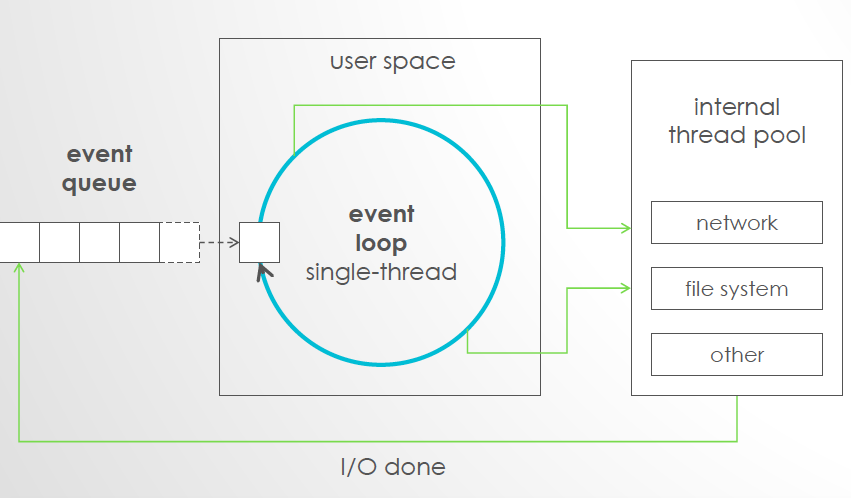

# 7-20 Lec

## Event Driving

### Multi-processing:

* Multiple systems run their processes \(programs\) at the same time.
* One machine/system runs one process/program, one process has its own resource.
* Processes are independent between each other.
* There are virtual memory is involved

### Multi-threading:

* Multiple threads run on a system/machine at the same time.
* Threads on the same system share the same resources
* No virtual memory is involved
* You need to avoid deadlock
* e.g.
  * browser
  * web server \(each user represents a thread\)

## Event Driven Execution \(JS\):

* Event loop is Single threaded, one task at a time

