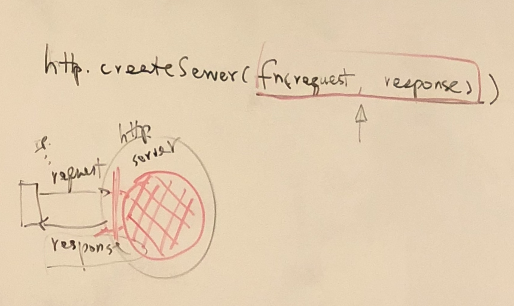

# 7-25 Lec

## Node.js

* Server side Java Script
* Provide an easy way to develop scalable network servers
* An environment to develop high performance web services
* Using event-drive, asynchronous I/O to minimize overhead and maximize scalability
* Essentially it is JS + modules

## Types of Modules:

* Core Modules:
  * within node.js
  * names are reserved
  * only need to load it into your module
  * e.g.
    * fs
    * http
    * net
* npm Modules:
  * from npmjs.org
  * under/node\_modules
* File Modules:
  * user developed
  * defined with module.exports
  * typically at current directory
  * has to give path to load:
    * import: `require ('/path_name')`
    * export: `module.exports`

```javascript
const fs = require('fs');

// async write
fs.writeFile('hello.txt', 'hello from Node!\n', function(err) {
    if (err) {
        // error handling
    } else {
        // do normal operation
    }
})

// OR
// sync write
try{
    fs.writeFileSync('/path_to_file', 'msg')
    // do normal operation
} catch(err) {
    console.log(err);
}
```

## HTTP \(Web\) Server - Core

* Async with callbacks 
  * By default
* Load:
  * const http = require\('http'\);
* Related
  * Also https module
* Use:
  * createServer\(\)



```javascript
const http = require('http');

const server = http.createServer(function(req, res){
    console.log(`${req.method}${req.url}`);
    res.end("hello world! You entered" + `${req.url}`);
})

const port = 8080;
server.listen(port, function(){
    console.log(`server started on port ${port}`);
})
```

## Node Package Management

* npm:
  * browser popular packages/modules
  * publish 

