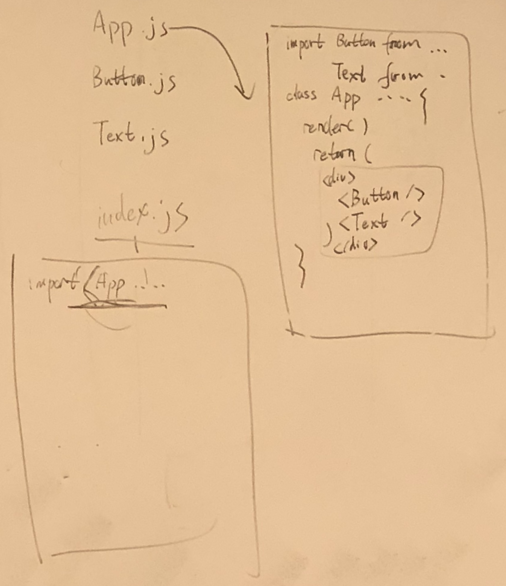

# React 8-1 Lec



* Declarative
* Component-based
* Learn once, write anywhere

## Why React?

* React talks to the virtual DOM, then virtual DOM will talk to real DOM
* small APIs to learn

## JSX:

### The only place to use JSX is in the return of the render function inside a react component.

### You must have a 'container'

If we want to return more elements, we need to wrap it with one container element. 

### The HTML Tag have to be closed

### Different XML Attributes Names

Since JSX is closer to JavaScript than to HTML, React DOM uses camelCase property naming convention instead of HTML attribute names.

For example, class becomes className in JSX, and tabindex becomes tabIndex.

### Embedding Javascript Expressions in JSX

You can embed any JavaScript expression in JSX by wrapping it in curly braces.

### **NOTE: You can not use Javascript expresssions that require curly braces in syntax, like `if`,`for`, `while`, `switch`.**

But we can use conditional expressions

### Inline Style

The style attribute accepts a JavaScript object with camelCased properties rather than a CSS string.

## Components:

Components let you split the UI into independent, reusable pieces, and think about each piece in isolation.

Usually one component per file

```javascript
// someFile.js
const number = 1;
const Data = {
    number: number,
    string: "1"
}

export default Data;
export number;

// callingFile.js
import Data, {number} from 'someFile.js'
```

Capitalize the name of each component file, each component file needs to import React, each component needs to be exported for other js files to import

## Rendering React Component:



HTML:

```markup
<!DOCTYPE html>
<html lang="en">
  <head>
    <title>React App</title>
  </head>
  <body>
    <div id="root"></div>
  </body>
</html>
```

React:

```javascript
import React, {Component} from 'react';
import ReactDOM from 'react-dom';

class App extends Component {
  render() {
    return <div>Hello World!!!</div>;
  }
}

ReactDOM.render(<App />, document.getElementById('root'));
```

This is what will happen in this exmaple:

* We call ReactDOM.render\(\) with the `<App />` component, to render `<App />` inside `<div id="root"></div>`.
* Our App component returns a `<div>Hello World!!!</div>` as the result.
* React DOM efficiently updates the HTML DOM to match `<div>Hello World!!!</div>`.

## Props:

Props/properties are how components talk to each other by passing values around/down level, especially pass data from parent component to child components, not other way around.

Suppose we design the Text component in a separate file `Text.js`:

```javascript
// Text.js
import React, {Component} from 'react';

class Text extends Component {
  render() {
    console.log(this.props);
    // {
    //   stringProps: "I am a string",
    //   numberProps: 1,
    //   objectProps: {a: 1, b: 2, c: 3},
    //   arrayProps: [1, 2, 3, 4, 5]
    // }
    return <p>{this.props.text}</p>;
  }
}

export default Text;
```

And in order to use the Text component in our main component, we just need to import Text component:

```javascript
import React, {Component} from 'react';
import Text from './Text.js';

class App extends Component {
  render() {
    const stringProps = 'I am a string';
    const numberProps = 1;
    const objectProps = {a: 1, b: 2, c: 3};
    const arrayProps = [1, 2, 3, 4, 5];
    return (
      <Text
        stringProps={stringProps}
        numberProps={numberProps}
        objectProps={objectProps}
        arrayProps={arrayProps}
      />
    );
  }
}
```

## State:

* A place to store data inside the component. It is similar to JS object, but it is immutable.
* A component's state should be considered as private data. 
* Only Class component has state, functional Component does not.
* In order to use state, we have the initialize it inside class constructor

```javascript
import React from 'react';

class HelloWorld extends React.Component {
  // you need the construtor to init state
  constructor(props) {
    super(props); // You have to run this before you init state
    this.state = {number: 1}; 
  }
  render() {
    return <h1>Hello World.</h1>;
  }
}
```

* Note: When you initialize the state, you can set the default state instead "empty":

### Read state

You can read the state anywhere inside the component by `this.state`:

```javascript
class HelloWorld extends React.Component {
  // you need the construtor to init state
  constructor(props) {
    super(props); // You have to run this before you init state
    this.state = {number: 1};
  }
  render() {
    console.log(this.state); // {number: 1}
    return <h1>{this.state.number}</h1>;
  }
}
```

### Set state

Since the state is immutable, we can not set the value like what used to do for Javascript Object. Instead, we have a special function called `setState` to help us set the state:

```javascript
class App extends Component {
  constructor(props) {
    super(props);
    this.state = {number: 1};
  }
  addOne = () => {
    this.setState({number: this.state.number + 1});
  };
  render() {
    return (
      <div>
        <p>{this.state.number}</p>
        <button onClick={this.addOne}>Add One</button>
      </div>
    );
  }
}
```

```javascript
class App extends Component {
  constructor(props) {
    super(props);
    this.state = {one: 1, two: 2, three: 3};
  }
  changeState = () => {
    this.setState({one: 111});
  };
  render() {
    return (
      <div>
        <p>{this.state.one}</p>
        <p>{this.state.two}</p>
        <p>{this.state.three}</p>
        <button onClick={this.changeState}>change</button>
      </div>
    );
  }
}
```

#### Three important principles of setting state {#three-important-principles-of-setting-state}

* Do not modift state directly, use `setState()` instead. The only place you can assign value to `this.state` is in the constructor.
* `setState()` may be asynchronous.
* State updates are **merged**.


