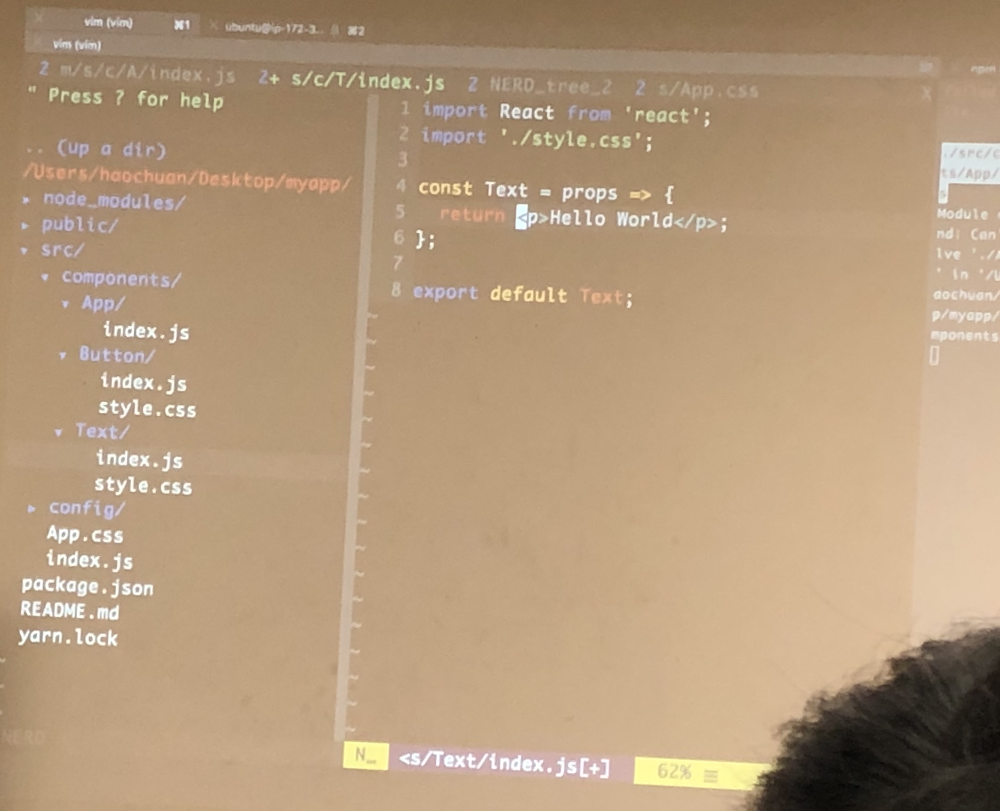

# React 8-3 Lec

## Component Life Cycle

**Note: Only class components have component life cycle**

Each React component has several “lifecycle methods” that you can override to run code at particular times in the process. Methods prefixed with will are called right before something happens, and methods prefixed with did are called right after something happens.

Through lifecycle methods, we can then control what happens when each tiny section of your UI renders, updates, thinks about re-rendering, and then disappears entirely.

### Component Life Cycle orders:

* constructor

  The constructor for a React component is called before it is mounted. When implementing the constructor for a React.Component subclass, you should call super\(props\) before any other statement. Otherwise, this.props will be undefined in the constructor, which can lead to bugs.

* render\(\)
* componentDidMount\(\)

  componentDidMount\(\) is invoked immediately after a component is mounted.

* shouldComponentUpdate\(nextProps, nextState\)

  shouldComponentUpdate\(\) is invoked before rendering when new props or state are being received. Defaults to true. Use shouldComponentUpdate\(\) to let React know if a component’s output is not affected by the current change in state or props.

* render\(\)
* componentDidUpdate\(prevProps, prevState\)

  componentDidUpdate\(\) is invoked immediately after updating occurs.

* componentWillUnmonut\(\)

  componentWillUnmount\(\) is invoked immediately before a component is unmounted and destroyed.

## Handling Event

Handling events with React elements is very similar to handling events on DOM elements. There are some syntactic differences:

* React events are named using camelCase, rather than lowercase.
* With JSX you pass a function as the event handler, rather than a string.

```javascript
class HelloWorld extends React.Component {
  showAlert() {
    console.log(this); // HelloWorld component ifself
    alert('hello');
  }
  render() {
    return <button onClick={this.showAlert.bind(this)}>Click Me</button>;
  }
}
```

**NOTE: If you are going to define a new function inside a react component, please use the arrow function shown as below:**

```javascript
class HelloWorld extends React.Component {
  showAlert = () => {
    console.log(this); // HelloWorld component itself
    alert('hello');
  };
  render() {
    return <button onClick={this.showAlert}>Click Me</button>;
  }
}
```

### onChange event

```javascript
class HelloWorld extends React.Component {
  // e is the event, here should be a `onChange` event
  // e.target is the where the event is happening
  // e.target.value is the value of the element where the event is happening
  showInput = e => {
    console.log(e.target.value);
  };
  render() {
    return <input onChange={this.showInput} />;
  }
}
```

## Conditional Rendering:

## Form Components Controlling:

```jsx
class App extends React.Component {
    constructor(props) {
        super(props);
        this.state = {input: ''};
    }
    handleInput = e => {
        this.setState({input: e.target.value});
    };
    render() {
        return <input value={this.state.input} onChange={this.handleInput} />
    }
}

export default App;
```

In HTML, form elements such as `<input>`, `<textarea>`, and `<select>` typically maintain their own state and update it based on user input. In React, mutable state is typically kept in the state property of components, and only updated with setState\(\).

We can combine the two by making the React state be the “single source of truth”. Then the React component that renders a form also controls what happens in that form.

An input form element whose value is controlled by React in this way is called a “controlled component”.

```jsx
class App extends Component {
  constructor(props) {
    super(props);
    this.state = {textInput: '', textArea: '', select: ''};
  }

  handleInputChange = e => {
    this.setState({textInput: e.target.value});
    console.log('set textInput to: ', e.target.value);
  };
  handleTextAreaChange = e => {
    this.setState({textArea: e.target.value});
    console.log('set textArea to: ', e.target.value);
  };
  handleSelectChange = e => {
    this.setState({select: e.target.value});
    console.log('set select to: ', e.target.value);
  };

  handleSubmit = e => {
    e.preventDefault(); // prevent Default HTML action, e.g. avoid go to other website
    console.log('The values in the form are: ', this.state);
  };

  render() {
    const formStyle = {
      margin: 'auto',
      padding: '50px',
    };
    const rowStyle = {
      margin: '10px',
      width: '300px',
      height: '100px',
      padding: '10px',
    };
    return (
      <form style={formStyle} onSubmit={this.handleSubmit}>
        <div style={rowStyle}>
          <label>
            Text Input
            <input
              type="text"
              value={this.state.textInput}
              onChange={this.handleInputChange}
            />
          </label>
        </div>
        <div style={rowStyle}>
          <label>
            Text Area
            <textarea
              value={this.state.textArea}
              onChange={this.handleTextAreaChange}
            />
          </label>
        </div>
        <div style={rowStyle}>
          <label>
            Select:
            <select
              value={this.state.select}
              onChange={this.handleSelectChange}>
              <option value="">Please select:</option>
              <option value="1">1</option>
              <option value="2">2</option>
              <option value="3">3</option>
            </select>
          </label>
        </div>
        <div style={rowStyle}>
          <input type="submit" value="Submit" />
        </div>
      </form>
    );
  }
}
```


## What is the best way to struture the code for a React project?

* Use directory for component, and use `index.js` as the entry point.
* Make every component fully seperated.
* Make component reusable.



