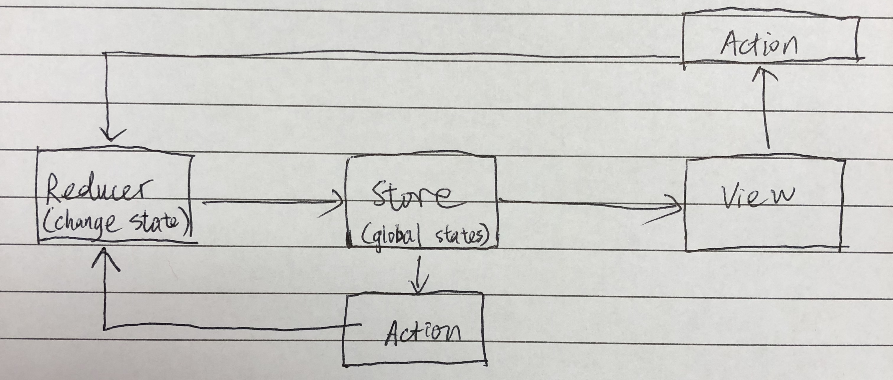

# Redux 8-10 Lec

## Redux: 

A global and predictable state container for JS apps. It can be used for any JS apps, not only React.

## When to use Redux:

* **Share the same state/data with multiple components**:

  Same piece of application state needs to be mapped to multiple container components. A good example of this is user state. When the app first loads, information about the user needs to be shared with various components in the navbar and each page. It’s likely these components don’t have any direct relationship so Redux provides a convenient way to share state.

* **Too many props are being passed through multiple parent-and-child components.**
* **You want to separate state out of components for a better code structure**

> Note: If the React project you’re working on doesn’t meet any of these criteria, then setState would likely do just fine. Redux really just becomes a tool to use in the right situation.

It is recommended to consider using Redux right from the start. Another opinion says to only start using Redux when you absolutely need it. However, in most of the cases, state management can get ugly and hard to maintain very quickly.

