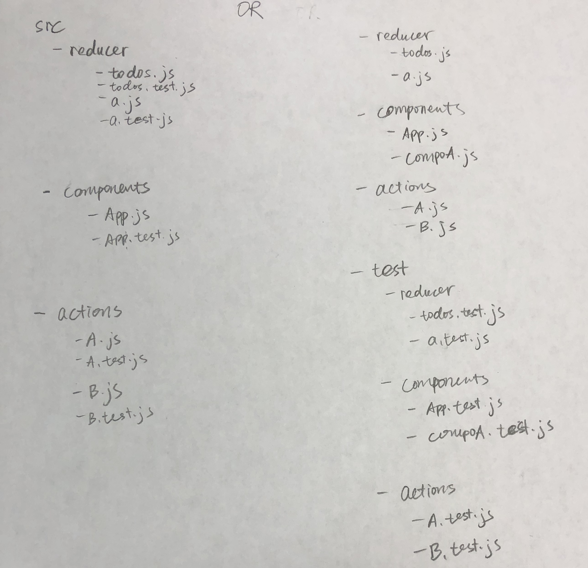
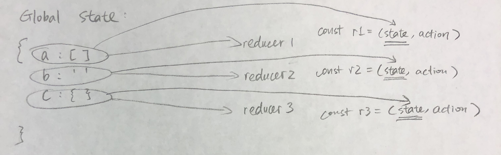

# Redux 8-13 Lec

## Redux Three Principles {#redux-three-principles}

#### Single source of truth {#single-source-of-truth}

The state of your whole application is stored in an object tree within a single store. In other word: the entire state of the application will be represented by one JavaScript object.

Example: [twitter](https://mobile.twitter.com/)

#### State is read-only {#state-is-read-only}

The only way to change the state is to emit an action, an object describing what happened.

The second principle of Redux is that the state tree is read only. Any time you want to change the state, you have to dispatch an action. **An action is a plain JS object describing the change. Just like the state is the minimal representation of the data, the action is the minimal representation of the change to that data.**

#### Changes are made with pure functions {#changes-are-made-with-pure-functions}

To specify how the state tree is transformed by actions, you write pure reducers.

Before learning more about Redux, it's important to know the difference between "Pure" and "Impure" functions.

* Pure function

```javascript
function square(x) {
  return x * x;
}
function squareAll(items) {
  return items.map(square);
}
```

**Pure functions** are those whose return values depend only upon the values of their arguments. Pure functions don't have side effects like network or database calls. Pure functions also do not override the values of anything. In the above example, a new array is returned instead of modifying the items that was passed in.

* Impure function

```javascript
function square(x) {
  updateXInDatabase(x);
  return x * x;
}
function squareAll(items) {
  for (let i = 0; i < items.length; i++) {
    items[i] = square(items[i]);
  }
}
```

Contrast the "Impure" function. A database is called, and values passed in are being overwritten.

## Reducer:

**Inside a Redux application there is one particular function that takes the previous state and the action being dispatched, and returns the next state of the whole application. Reducer is the function knowing how to return a new state based on the action it receives. Reducer should be a pure function.**

It is important that the function is pure \(i.e. the state being given to it isn't modified\) because it has to return the new object representing the application's new state.

This is the 3rd and final principle of Redux: **to describe the logic of how to change the state you have to write a function that takes the previous state of the app and the action being dispatched, then returns the next state of the app. This function is called the Reducer.**

e.g. Counter reducer example:

When writing a reducer, if state is not defined, return an initial state. In this counter example, we return 0 since our count will start from there. If the action being passed in isn't one the reducer recognizes, we just return the current state.

```javascript
const counter = (state = 0, action) => {
  switch (action.type) {
    case 'INCREMENT':
      return state + 1;
    case 'DECREMENT':
      return state - 1;
    default:
      return state;
  }
};

const increaseAction = {type: 'INCREMENT'};
const decreaseAction = {type: 'DECREMENT'};
const otherAction = {type: 'OTHER'};

console.log(counter(0, increaseAction)); // return 1
console.log(counter(1, decreaseAction)); // return 0
console.log(counter(0, otherAction)); // return 0
```

## Store

The store binds together the 3 principles of Redux:

* Holds the current application state object
* Allows you to dispatch actions, only store can dispatch actions.
* When you create it, you need to specify the reducer that tells how state is updated with actions.

E.g. how to create a store:

```javascript
import {createStore} from 'redux';

const counter = (state = 0, action) => {
  switch (action.type) {
    case 'INCREMENT':
      return state + 1;
    case 'DECREMENT':
      return state - 1;
    default:
      return state;
  }
};

const store = createStore(counter);
```

`store` has three important methods:

1. `getState()` retrieves the current state of the Redux store. If we ran `console.log(store.getState())` with the code above, we could get `0` since it is the initial state of our application.
2. `dispatch()` is the most commonly used. It is how we dispatch actions to change the state of the application. If we run `store.dispatch( { type: 'INCREMENT' });` followed by `console.log(store.getState());` we will get `1`.
3. `subscribe()` registers a callback that the redux store will call any time an action has been dispatched so you can update the UI of your application to reflect the current application state. If you have the function `print()` and you write `store.subscribe(print)`, the `print()` function will be called every time if an action has been dispatched.


```jsx
import React from 'react';
import ReactDOM from 'react-dom';
import {createStore} from 'redux';

const counterReducer = (state = 0, action) => {
  console.log('Action received: ');
  console.log(action);
  switch (action.type) {
    case 'INCREMENT':
      return state + 1;
    case 'DECREMENT':
      return state - 1;
    default:
      return state;
  }
};

const store = createStore(counterReducer);

const Counter = ({value, onIncrement, onDecrement}) => (
  <div>
    <h1>{value}</h1>
    <button onClick={onIncrement}>+</button>
    <button onClick={onDecrement}>-</button>
  </div>
);

const render = () => {
  console.log('Current State: ');
  console.log(store.getState());
  ReactDOM.render(
    <Counter
      value={store.getState()}
      onIncrement={() =>
        store.dispatch({
          type: 'INCREMENT',
        })
      }
      onDecrement={() =>
        store.dispatch({
          type: 'DECREMENT',
        })
      }
    />,
    document.getElementById('root'),
  );
};

store.subscribe(render);
render();
```

When the Counter is rendered, we specify that its value should be taken from the Redux store's current state. When the user presses a button, the corresponding action is dispatched to the Redux store.

The reducer specifies how the next state is calculated based on the current state and the action being dispatched.

Finally, **we subscribe to the Redux store so our render\(\) function runs any time the state changes so our Counter gets the current state.**

## Jest: Testing tool

> Note: pay more attention to corner \(non-common\) cases for testing, avoid duplications

2 different ways of structuring test files:



## Todo List Example - Combine Reducers {#todo-list-example---combine-reducers}

Redux provides a utility function called `combineReducers()`, which help each of reducers manage its own part of the global state. **The `state` parameter is different for every reducer, and corresponds to the part of the state it manages**.

e.g.



Let's create an entry point for all of the reducers. Create a file `index.js` in `src/reducers/`.

```javascript
import {combineReducers} from 'redux';
import todos from './todos';
import filter from './filter';

const reducers = combineReducers({
  todos,
  filter,
});

export default reducers;
```

Above results in the following global state:

```text
Global state:
{
    todos: [],
    filter: 'all'
}
```

When the app is larger, we can split the reducers into separate files and keep them completely independent and managing different data domains.

