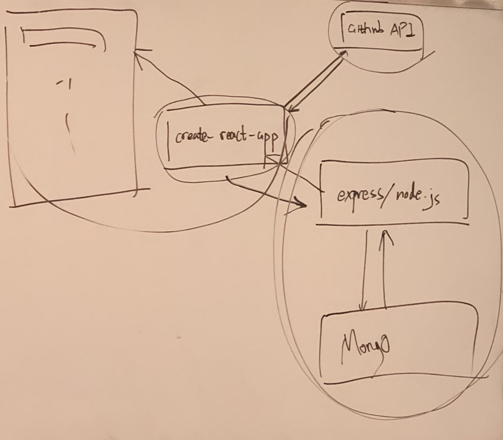

# Redux 8-17 Lec

## Redux-thunk:

It is a middleware that is mainly used in Async actions like http requests

> Note: Only component has access to dispatch, action/action creator doesn't have access to dispatch.

## Connect create-react-app with express server {#connect-create-react-app-with-express-server}




### Express server

```javascript
const express = require('express');
const app = express();
const faker = require('faker'); // generate fake/random data for practice

const PORT = 4000;

function generateData(length = 10) {
  const data = [];
  for (let i = 0; i < length; i++) {
    const user = {
      id: faker.random.uuid(),
      name: faker.name.firstName(),
      email: faker.internet.email(),
      image: faker.image.avatar(),
    };
    data.push(user);
  }
  return data;
}

// get('/api/users') will look for server or server proxy which serves this request
app.get('/api/users', (req, res) => {
  const users = generateData(5);
  setTimeout(() => {
    res.status(200).json(users);
  }, 5000);
});

app.listen(PORT, () => {
  console.log(`Express Server is running on port ${PORT}`);
});
```

### Proxy in create-react-app

```javascript
{
  "name": "myapp",
  "version": "0.1.0",
  "private": true,
  "dependencies": {
    "axios": "^0.18.0",
    "react": "^16.4.2",
    "react-dom": "^16.4.2",
    "react-redux": "^5.0.7",
    "react-scripts": "1.1.4",
    "redux": "^4.0.0",
    "redux-thunk": "^2.3.0"
  },
  "scripts": {
    "start": "react-scripts start",
    "build": "react-scripts build",
    "test": "react-scripts test --env=jsdom",
    "eject": "react-scripts eject"
  },
  "proxy": "http://localhost:4000/"
  // Important!!!   
  // need to add this proxy because it is used to serve http requests for client side
  // this solves the cross-origin/domain restriction in browser request
  // i.e. there is a restriction for client send a http request from a different server/origin/domain
  // Or you can use a middleware 'CORS' inside express(backend server) to sovle this problem
}
```

## Cross-domain/origin restriction:

* A restriction when client sends a http request to a different server/origin
* Only happen in browser
* How to solve this:
  * Method1: Add a proxy inside create-react-app json file
  * Method2: Add a middleware 'CORS' inside express \(backend server\)

